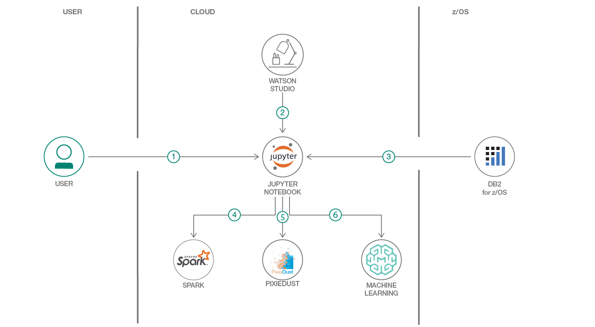
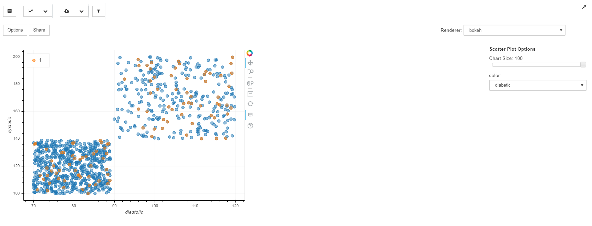
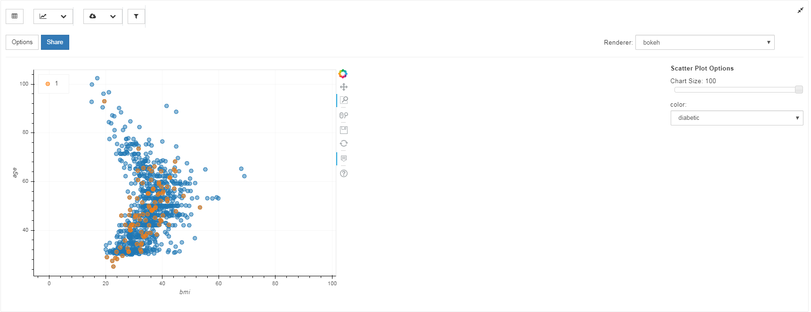

> **DISCLAIMER**: This notebook is used for demonstrative and illustrative purposes only and does not constitute an offering that has gone through regulatory review. It is not intended to serve as a medical application. There is no representation as to the accuracy of the output of this application and it is presented without warranty.

# Machine learning using synthesized patient health records

This notebook explores how to train a machine learning model to predict type 2 diabetes using synthesized patient health records.
The use of synthesized data allows us to learn about building a model without any concern about the privacy issues surrounding the use of real patient health records.

When the reader has completed this Code Pattern, they will understand how to:

* Prepare data using Apache Spark.
* Visualize data relationships using Pixiedust.
* Train a machine learning model and publish it in the Watson Machine Learning (WML) repository.
* Deploy the model as a web service and use it to make predictions.

## Flow

1. Log in to IBM Watson Studio
2. Load the provided notebook into Watson Studio
3. Load data in the notebook
4. Transform the data with Apache Spark
5. Create charts with PixieDust
6. Publish and deploy model with Watson Machine Learning

# Prerequisites

This project is part of a series of code patterns pertaining to a fictional health care company called Summit Health.
This company stores electronic health records in a database on a z/OS server.
Before running the notebook, the synthesized health records must be created and loaded into this database.
Another project, https://github.com/IBM/summit-health-synthea, provides the steps for doing this.
The records are created using a tool called [Synthea](https://github.com/synthetichealth/synthea), transformed and loaded into the database.

If required, set up the [Secure Gateway service](https://console.bluemix.net/docs/services/SecureGateway/index.html#getting-started-with-sg)
to provide you with a secure way to access your on-premise data source.

# Steps

## Sign up for Watson Studio

Sign up for [IBM Watson Studio](https://dataplatform.ibm.com). 

## Create a project

* Click the **Create a project** tile.
* A list of project types appears.  Click the **Data Science** project type.
* Provide a name for the project (e.g. "diabetes-prediction") and click the **Create** button.
* The project is saved in a lite object storage instance in your account. 

## Create a Watson Machine Learning instance

* Click on the **Settings** tab of your project.
* Scroll down to **Associated Services**.
* Click **Add service** and select **Watson** from the drop-down menu. 
* Click **Add** on the **Machine Learning** tile.
* Select the lite plan and click the **Create** button.

## Add the notebook to your project

* Click on the **Add to project** button.
* Click on **Notebook**.
* Click on **From URL**.
* Fill in a name for the notebook (e.g. "diabetes-prediction").
* Copy and paste this URL into the notebook URL field: https://raw.githubusercontent.com/IBM/summit-health-machine-learning/master/diabetes-prediction.ipynb
* In the **Select runtime** drop-down box, choose the entry that begins with **Default Spark Python**.
* Click the **Create Notebook** button.

## Run the notebook

* Click on **Cell** in the menu bar and select **All Output** > **Clear** to clear out the existing notebook output.

* Move your cursor to each code cell and run the code in it.  Read the comments for each cell to understand what the code is doing.
When the code in a cell is still running, the label to the left changes to In [*]:. 
Do not continue to the next cell until the code is finished running.

* There are a couple of cells which you have to update to provide your credentials.

    * At the top of the notebook is a cell for your database credentials.
    * Further on you will encounter a cell for your Watson Machine Learning credentials.
      In order to find these, click on the hamburger menu at the top left of the screen and select **Watson Services**.
      Click on your machine learning instance and then click on the **Service Credentials** tab.
      Click on **View Credentials**.

# Sample output

The notebook uses Pixiedust to visualize relationships between the data.
Here are examples of scatter plots that it can produce.

* HDL/LDL cholesterol for diabetics vs non-diabetics.
  The diabetes simulation in Synthea uses a distinct range of HDL readings for diabetic vs. non-diabetic patients.
  This makes the correlation of cholesterol readings to diabetes abnormally high.

* Systolic/diastolic blood pressure for diabetics vs non-diabetics.
  The diabetes simulation in Synthea increases the chance of high blood pressure (hypertension) for diabetics
  but the non-diabetic patients also can have high blood pressure.  Therefore the correlation
  of high blood pressure to diabetes isn't very strong.

* Body mass index  for diabetics vs non-diabetics.
  The diabetes simulation in Synthea does not change the weight of any diabetic patients so BMI has no correlation.

## License

This code pattern is licensed under the Apache License, Version 2.
Separate third-party code objects invoked within this code pattern are licensed by their respective providers pursuant to their own separate licenses.
Contributions are subject to the [Developer Certificate of Origin, Version 1.1](https://developercertificate.org/) and the [Apache License, Version 2](https://www.apache.org/licenses/LICENSE-2.0.txt).

[Apache License FAQ](https://www.apache.org/foundation/license-faq.html#WhatDoesItMEAN)
